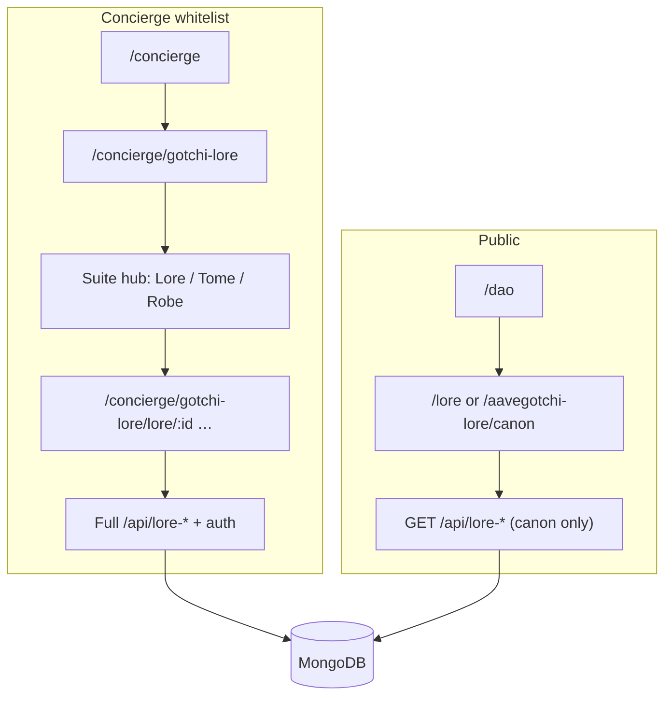

# Concierge × gotchi-lore integration plan

Goal: merge **gotchi-lore** natively into [AarcadeGh-t](~/dev/AarcadeGh-t) with two entry points:

1. **Concierge (whitelisted)** — full Lore + Tome + Robe workspace for editors  
2. **DAO page (public)** — read-only link to canon lore for anyone  

---

## Decisions (confirmed)

| Decision | Choice |
|----------|--------|
| Integration style | **Native merge** — copy views/components/routes into AarcadeGh-t (not iframe) |
| Concierge access | **Whitelist required** — same gate as Transfers / Lending Tool |
| Public access | **DAO page link** — public read-only lore (canon), no whitelist |
| Production | **Single deploy** — gotchi-lore lives inside AarcadeGh-t repo |

---

## Architecture



**Standalone `gotchi-lore` repo** remains the **source of truth for development**; changes sync into AarcadeGh-t via script + manual merge until we automate copy.

---

## Route map (AarcadeGh-t)

### Public (read-only)

| Path | View | Access |
|------|------|--------|
| `/aavegotchi-lore` | Public lore landing | Anyone |
| `/aavegotchi-lore/canon` | Canon worlds/pages (read-only) | Anyone |
| `/aavegotchi-lore/canon/:worldId` | Canon world reader | Anyone |
| `/aavegotchi-lore/canon/:worldId/:pageKey` | Single page reader | Anyone |

Use `/aavegotchi-lore` prefix to avoid clashing with existing `/lore` if any, and to brand clearly on DAO.

### Concierge (full suite, whitelisted)

| Path | View | Access |
|------|------|--------|
| `/concierge/gotchi-lore` | Suite hub (Lore / Tome / Robe cards) | Whitelist |
| `/concierge/gotchi-lore/lore` | World list | Whitelist |
| `/concierge/gotchi-lore/lore/:worldId` | Lore workspace | Whitelist |
| `/concierge/gotchi-lore/lore/:worldId/*` | templates, maps, diagrams, sync, proposals… | Whitelist |
| `/concierge/gotchi-lore/tome` | Chronicle list | Whitelist |
| `/concierge/gotchi-lore/tome/:id` | Tome workspace | Whitelist |
| `/concierge/gotchi-lore/tome/:id/*` | play, link, sync… | Whitelist |
| `/concierge/gotchi-lore/robe` | Robe board list | Whitelist |
| `/concierge/gotchi-lore/robe/:id` | Robe workspace | Whitelist |

Redirect legacy `/gotchi-lore` → `/concierge/gotchi-lore`.

---

## Phases

### Phase 1 — Copy frontend into AarcadeGh-t

**Effort:** ~1–2 days  
**Source:** `gotchi-lore/src/`  
**Target:** `AarcadeGh-t/src/gotchi-lore/` (namespace to avoid collisions)

| Copy | Notes |
|------|-------|
| `views/lore/*`, `views/tome/*`, `views/robe/*`, `views/SuiteHub.vue` | Rename imports |
| `components/lore/*`, `components/tome/*`, `components/robe/*`, `components/shared/*` | Dedupe vs existing Aarcade shared components |
| `utils/*`, `constants/*`, `stores/*`, `seed/*` | Wallet store → bridge to `web3Store` |
| `services/api.js`, `services/auth.js` | `VITE_API_BASE=''` (same-origin `/api`) |

**Layout strategy**

- **Concierge routes:** wrap in Aarcade `Layout` + Concierge chrome (`← Back to Concierge`, arcade frame) — reuse `ConciergePettingBot` / `Transfers` shell
- **Public routes:** lighter public layout (DAO-adjacent styling) — no edit controls, no wallet required for read

**Router:** add nested route tree under `/concierge/gotchi-lore` + public tree under `/aavegotchi-lore`.

---

### Phase 2 — Concierge hub tile + DAO public link

**AarcadeGh-t**

| Task | File |
|------|------|
| Concierge tile | `src/views/Concierge.vue` — link to `/concierge/gotchi-lore`, whitelist gated |
| Concierge shell layout | `src/views/ConciergeGotchiLoreLayout.vue` — back button + `<router-view>` |
| DAO public link | `src/views/Dao.vue` — card/link “Aavegotchi Lore” → `/aavegotchi-lore/canon` |
| Optional sidebar | `Sidebar.vue` — omit or admin-only; public entry is DAO |

**Read-only mode in views**

- Add prop or route meta `{ readOnly: true }` on public canon routes
- Hide: edit buttons, fork/sync, proposals, wallet-gated create
- Show: page tree, TipTap content (readonly), maps (view), cross-links

Existing canon API already exists: `GET /api/lore-worlds/canon`, world/page GET routes.

---

### Phase 3 — Complete API parity

**Fix sync script** (`gotchi-lore/scripts/sync-to-aarcadeghst.sh`):

- Copy from `backend/routes/` (not stale `api/routes/`)
- Include all 13 routes + `backend/services/*.cjs` dependencies

**Mount in AarcadeGh-t `api/server.js`:**

```
lore-worlds, lore-pages, tome-chronicles, story-nodes, realm-maps,
suite-assets, gotchi-import, lore-inventory, lore-diagrams,
lore-proposals, robe-boards, aibot, auth
```

**Mongo getters** — copy full set from `gotchi-lore/backend/lib/mongodb.cjs` into `AarcadeGh-t/lib/mongodb.cjs`.

**Vercel rewrites** — one rewrite per route prefix (see Phase 3 list in prior revision).

---

### Phase 4 — Auth unification

| Concern | Approach |
|---------|----------|
| Wallet address | Concierge views use Aarcade `web3Store.address` → set `X-Owner-Wallet` on API calls |
| SIWE token | Keep gotchi-lore `/api/auth` SIWE; trigger sign-in when user first edits (button in Concierge lore UI) |
| Public reads | No auth headers; backend returns canon/public data only |
| Whitelist | Client-side gate on Concierge routes via `isConciergeWhitelisted`; optional server check on mutating routes later |

**Do not** duplicate wallet connect UI — point users to Aarcade header wallet button (like `Transfers.vue`).

---

### Phase 5 — Styling & shared components

| Item | Action |
|------|--------|
| Tailwind / pixel theme | Align gotchi-lore tokens with Aarcade CSS variables where needed |
| `GotchiAibotEmbed` | Reuse Aarcade global AIBot or embed from existing env `VITE_AIBOT_URL` |
| Maps | Wire public/concierge lore maps to existing Aarcade gotchiverse/citadel map assets |
| Dedupe | Compare `GotchiTooltip`, `TabWorkspace`, etc. — merge into one shared module |

---

### Phase 6 — Sync workflow (ongoing)

Until monorepo extraction:

1. Develop features in `gotchi-lore` standalone (`npm run dev:all`)
2. Run updated `./scripts/sync-to-aarcadeghst.sh` for **API routes + services**
3. Run `./scripts/sync-frontend-to-aarcadeghst.sh` (to create) for **src copy** with path rewrites
4. Manual: router entries + Concierge/DAO links in AarcadeGh-t

Long-term: single repo or git submodule; short-term: scripted copy.

---

### Phase 7 — Testing

**Public**

- [ ] DAO link opens `/aavegotchi-lore/canon`
- [ ] Canon world + pages load without wallet
- [ ] No edit/fork UI visible

**Concierge**

- [ ] Non-whitelisted wallet sees disabled tile + overlay (existing Concierge pattern)
- [ ] Whitelisted user opens hub → Lore / Tome / Robe
- [ ] Create world, edit page, chronicle, robe board
- [ ] SIWE on first write operation

**API**

- [ ] All 13 route groups respond on Aarcade `:3001` / Vercel

---

## File checklist

### AarcadeGh-t (create/modify)

```
src/gotchi-lore/              # copied views, components, utils
src/views/ConciergeGotchiLoreLayout.vue
src/views/Concierge.vue       # tile
src/views/Dao.vue             # public link
src/router/index.js           # route trees
api/server.js                 # mount routes
lib/mongodb.cjs               # collection getters
vercel.json                   # rewrites
env.example                   # any new vars
```

### gotchi-lore (maintain as dev sandbox)

```
scripts/sync-to-aarcadeghst.sh     # fix + expand
scripts/sync-frontend-to-aarcadeghst.sh   # NEW
docs/concierge-integration-plan.md # this file
```

---

## Implementation order

```
1. API sync + Mongo getters + vercel rewrites     (backend works on Aarcade)
2. Copy src/gotchi-lore + router (Concierge tree)  (whitelisted full suite)
3. Concierge tile + layout shell
4. Public read-only views + DAO link
5. Auth bridge (web3Store + SIWE)
6. Styling pass + dedupe shared components
```

**First PR slice:** Phase 3 (API) + Concierge hub route with Lore list only — proves native merge before copying entire Tome/Robe surface.

---

## Open items (minor)

- [ ] Exact public URL slug: `/aavegotchi-lore` vs `/lore/canon`
- [ ] Concierge tool icon asset (`/images/lore.svg`?)
- [ ] Whether Robe video export works on Vercel function limits (may need longer `maxDuration`)
